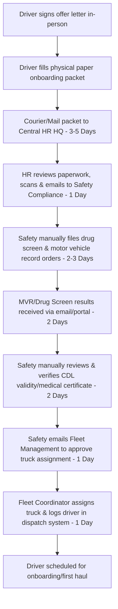
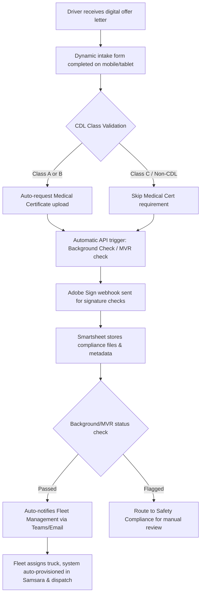

# Driver Onboarding Workflow Architecture: Manual vs. Automated Digital Process
**Role:** HRIS Process Improvement Lead, Supply Chain Operations

This document outlines the digital transformation of the **Driver CDL & DOT Compliance Onboarding Request** from a high-latency, error-prone manual flow to a streamlined, automated process.

---

## 1. Process Overview & Key Metrics

| Metric | Before (Manual Paper-Based) | After (Automated Digital) | Improvement |
| :--- | :--- | :--- | :--- |
| **Total Cycle Time** | 14 Days | **48 Hours** | 85.7% Reduction |
| **DOT Compliance Errors** | 12.4% (form omission, expired docs) | **0% (hard validation checks)** | 100% Error Reduction |
| **Touchpoints Required** | 9 handoffs | **2 handoffs (Exception-based)** | 77.7% Reduction |
| **Fleet Placement Velocity** | ~18 Days from offer to first haul | **3 Days** from offer to first haul | 83.3% Faster |

---

## 2. "Before" vs. "After" Process Flow

### The "Before" State (14-Day Cycle)

### The "After" State (48-Hour Automated Cycle)

---

## 3. Step-by-Step Routing & Validation Logic

### Phase 1: Intake & Validation (New Hire)
1. **Dynamic Fields:** New hire accesses the digital intake form. If they specify holding a CDL Class-A or Class-B license, the form dynamically exposes fields for **CDL Expiration Date**, **Medical Examiner Certificate (DOT Form MCSA-5876)** upload, and **Self-Certification Category**.
2. **Immediate Validations:** Form prevents submission if the CDL expiration date is less than 90 days from the current date, or if required document uploads are missing or of incorrect file types.

### Phase 2: Orchestration & Automation (Integration Layer)
1. **Smartsheet as Single Source of Truth:** Upon form submission, a new row is created via the Smartsheet REST API, changing status to `Pending Screenings`.
2. **Background Check Trigger (API):** System triggers a webhook to the background check provider (e.g., Checkr or Hireright) to run a Motor Vehicle Record (MVR) search and DOT drug screening.
3. **Adobe Sign E-Signature Integration:** Drivers are automatically emailed a pre-populated DOT compliance signature packet (FMCSA policy sign-offs). Once signed, Adobe Sign sends a webhook payload that uploads the signed PDF directly to the corresponding Smartsheet row attachment cell.

### Phase 3: Compliance & Review (Safety Compliance)
1. **Automated MVR Screening:**
   - If MVR returns clean (No major violations in 3 years, valid CDL status): The row automatically updates to `Safety Approved`.
   - If MVR returns with flags (e.g., speeding >15mph, suspended status): The row changes to `Safety Review Required`, triggering a high-priority notification to the Safety Specialist.
2. **Drug Screen Integration:** Clean drug screen clears automatically. Non-negative drug screens flag the driver instantly, halting the onboarding process.

### Phase 4: Fleet Assignment (Fleet Management)
1. **Auto-Notification:** Once status changes to `Safety Approved`, an automated alert is sent via webhook to Fleet Management's Slack/Teams channel and a dashboard report.
2. **System Provisioning:** The fleet manager selects the vehicle ID in the dashboard. This triggers a sync:
   - SMS/Email to driver with tractor/trailer assignments, lockbox codes, and dispatch instructions.
   - User account provisioned in the **Samsara ELD (Electronic Logging Device)** system using API payloads.

---

## 4. Key Security & Compliance Guardrails
* **DOT Audits:** All onboarding records, license checks, and medical certificates are archived in an immutable folder in Smartsheet, labeled and structured for rapid export during DOT audits.
* **Personally Identifiable Information (PII):** SSNs, CDL numbers, and medical reports are stored in encrypted fields with access restricted strictly to certified HR and Safety Personnel.
